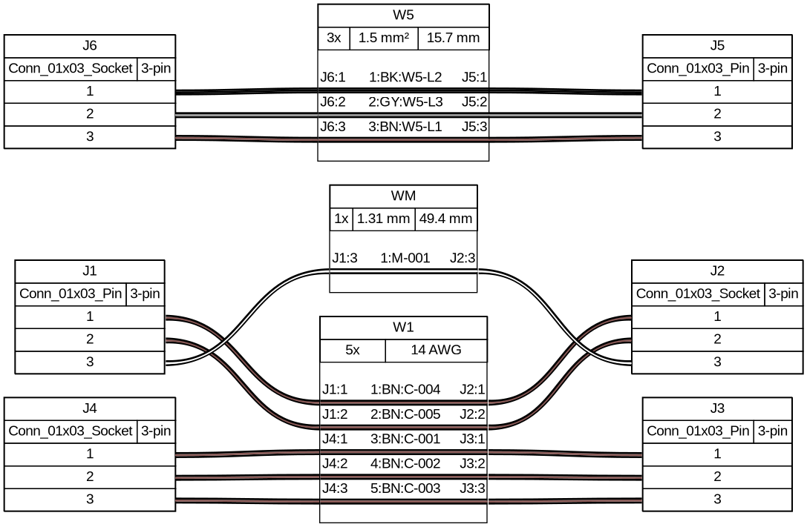

# harness_engine

Generate **wire-harness manufacturing documentation** straight from your KiCad
design: a point-to-point wire list (CSV) and a [WireViz](https://github.com/wireviz/WireViz)
YAML that renders into a harness diagram + BOM. The schematic/board stays the
single source of truth — the docs are generated, never hand-maintained.

*The diagram above was rendered by WireViz from a small demo board: three
cables, per-core colors, wire numbers, and real cut lengths measured from the
routed board.*

## How it works

You encode harness information using things KiCad already has:

| Harness concept | KiCad mechanism |
|---|---|
| Wire type (gauge, color) | **net class** name (e.g. `14AWG_BN`) |
| Multi-conductor cable | **named group bus** (`W5{L1 L2 L3}`) |
| Cut length | **routed track length** on the PCB |
| Connector part data (MPN) | **footprint fields** |

A small `harness_specs.yaml` next to your board maps those names to real wire
data (gauge, colors, shielding, numbering scheme). One click in the PCB editor
— **Tools → External Plugins → Generate harness docs** — writes the CSV and
WireViz YAML next to your board.

## Guide

1. **[Installation](installation.md)** — via KiCad's Plugin and Content
   Manager, or manual copy; plus the CLI.
2. **[Setting up your KiCad project](kicad-setup.md)** — how to name net
   classes, label cables, and place connectors so the exporter understands
   your design.
3. **[Drawing the panel](panel-layout.md)** — the project template, the
   Panel-device footprint wizard, datasheet-image footprints, and the
   generated panel wiring diagram (SVG).
4. **[Exporting](exporting.md)** — running the plugin or CLI, what's in the
   CSV, rendering the WireViz diagram, and how wire numbers stay stable.
5. **[harness_specs.yaml reference](SPEC_SCHEMA.md)** — the full spec-file
   schema.

## Two ways to run

- **Board route** (pcbnew Action Plugin) — the richest output, and the only
  route that yields real **cut lengths** (measured from your routed tracks).
- **Netlist route** (CLI) — works from a schematic netlist export alone, no
  footprints needed; everything except length.
