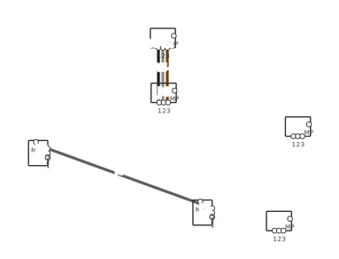

# Drawing the panel: making pcbnew look like a wiring diagram

The board *is* your wiring diagram — a 1:1 physical plan of the panel. Out of
the box pcbnew looks like a PCB editor, though: hairline tracks, pad dots, no
device drawings. This page is the recipe for making it read like an actual
panel drawing, and for getting a finished diagram out.

## Start from the project template

`templates/kicad_panel/` in the repo is a ready-made starting point:

- **Net classes as wire types** (`14AWG_BN`, `16AWG_BU`, `18AWG_RD`,
  `1.5MM2_GNYE`, `CTRL_GY`), each with a **color swatch** and a **track width
  sized like the wire** — so while you route, you see brown 1.6 mm wire, not a
  0.2 mm hairline.
- A **600 × 400 mm panel outline** on Edge.Cuts (resize to your enclosure) and
  a title block.
- A starter `harness_specs.yaml` already mapped to those classes.

Copy the folder into your KiCad template path (or set
`KICAD_USER_TEMPLATE_DIR` to the repo's `templates/`), then
**File → New Project → From Template**.

Two editor settings finish the look: in the Appearance panel, set **net
colors to "All"** (tracks render in their class color), and turn the
**ratsnest** off while placing. Draw DIN rails and wire duct on
**User.Drawings**.

## 2D device footprints in a minute — the "Panel device" wizard

Panel gear rarely has KiCad footprints. The plugin ships a footprint wizard
that generates them from a few numbers: open the **Footprint Editor** →
**New Footprint Using Wizard** → **Panel device**, and enter body width ×
height plus the terminal rows. Labels are free text, so `L1,L2,L3,A1` on top
and `T1,T2,T3,A2` below gives you a finished contactor footprint — body
outline on F.Fab + silk, named terminals at the real pitch.

A starter library ships in `library/panel_devices.pretty` (contactor,
1P/2P breakers, PSU, 3-phase motor terminal box, 12-way feed-through terminal
strip — the strip repeats pad numbers top/bottom on purpose, since both sides
of a feed-through terminal are the same circuit). Add it via
**Preferences → Manage Footprint Libraries**.

### Devices from a datasheet image

For a device where you want real artwork: **Image Converter** (in the KiCad
project manager) converts a datasheet front-view PNG to a footprint graphic —
import at 1:1 scale onto F.Fab. Then run the Panel device wizard with **draw
outline** unticked and the right terminal rows, and paste the image graphics
into the generated footprint. Result: a photo-accurate device with named,
routable terminals.

## The generated wiring diagram

Every export also writes **`<board>_panel.svg`** — a proper wiring diagram
drawn from the board's geometry plus the harness data:

- device outlines (from F.Fab, silk as fallback) with terminal labels,
- every wire as a thick line in its **actual insulation color** (IEC codes
  incl. green/yellow stripe, or hex colors straight from the net-class
  swatch),
- a **wire-number flag** on every run (collision-avoided, so bundles stay
  readable),
- the panel outline and the board's title block.

*(The example above is the repo's small test fixture — PCB-scale connectors.
With template-scale devices and track widths the proportions match a real
panel drawing.)*

SVG opens in any browser and prints at scale; convert to PDF with any SVG
tool if your shop wants PDF.
